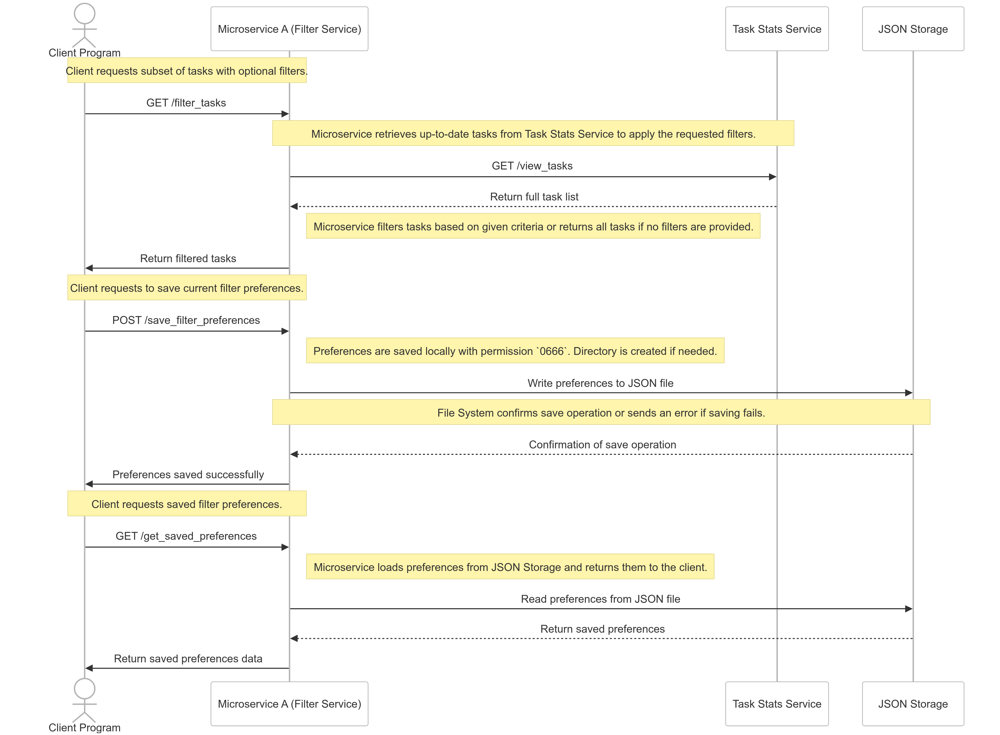

# Task Management API

This project is a microservices-based Task Management application that allows users to add, view, update, and analyze tasks. The application is built using Flask for backend services and Streamlit for the frontend interface. Docker Compose is used to orchestrate the services.

## Table of Contents

1. [Microservices](#microservices)
2. [Inclusivity Heuristics Justification](#inclusivity-heuristics-justification)
3. [Testing Microservice A](#testing-microservice-a)
4. [Task Filter Service Communication Contract](#task-filter-service-communication-contract)
5. [Setup Instructions](#setup-instructions)
6. [Future Enhancements](#future-enhancements)

## Microservices
### Implemented Microservices

#### 1. Task Stats Service
- **Description:** Manages tasks and provides statistics.
- **Endpoints:**
  - **Get Statistics**
    - **URL:** `/stats`
    - **Method:** `GET`
    - **Description:** Returns total tasks, completed tasks, pending tasks, and average completion time.
  - **Task Summary**
    - **URL:** `/task_summary`
    - **Method:** `GET`
    - **Description:** Returns completion statistics grouped by priority level.
  - **Completion Times**
    - **URL:** `/completion_times`
    - **Method:** `GET`
    - **Description:** Returns list of completion times for completed tasks.
  - **Add Task**
    - **URL:** `/add_task`
    - **Method:** `POST`
    - **Description:** Adds a new task.
    - **Request Body:** JSON object representing the task.
  - **View Tasks**
    - **URL:** `/view_tasks`
    - **Method:** `GET`
    - **Description:** Returns a list of all tasks.
  - **Update Task**
    - **URL:** `/update_task`
    - **Method:** `POST`
    - **Description:** Updates an existing task.
    - **Request Body:** JSON object with task ID and updated data.
  - **Delete Task**
    - **URL:** `/delete_task`
    - **Method:** `POST`
    - **Description:** Deletes a task.
    - **Request Body:** JSON object with task ID.

#### 2. Reminder Service
- **Description:** Provides reminders for upcoming tasks.
- **Endpoints:**
  - **Get Reminders**
    - **URL:** `/reminders`
    - **Method:** `GET`
    - **Description:** Returns tasks due within the next day.
  - **Mark Complete**
    - **URL:** `/mark_complete`
    - **Method:** `POST`
    - **Description:** Marks a task as complete and records completion time.
    - **Request Body:** JSON object with task ID.

#### 3. Task Filter Service
- **Description:** Filters tasks and manages filter preferences.
- **Endpoints:**
  - **Filter Tasks**
    - **URL:** `/filter_tasks`
    - **Method:** `GET`
    - **Description:** Returns filtered tasks based on criteria.
    - **Query Parameters:** 
      - `priority` (low, medium, high)
      - `due_date` (YYYY-MM-DD)
      - `completed` (true, false)
  - **Save Filter Preferences**
    - **URL:** `/save_filter_preferences`
    - **Method:** `POST`
    - **Description:** Saves user's filter preferences.
    - **Request Body:** JSON object with filter criteria.
  - **Get Saved Preferences**
    - **URL:** `/get_saved_preferences`
    - **Method:** `GET`
    - **Description:** Returns saved filter preferences.
  - **Clear Preferences**
    - **URL:** `/clear_preferences`
    - **Method:** `POST`
    - **Description:** Clears all saved filter preferences.

#### 4. Productivity Analysis Service
- **Description:** Analyzes productivity based on task completion.
- **Endpoints:**
  - **Productivity**
    - **URL:** `/productivity`
    - **Method:** `GET`
    - **Description:** Returns productivity percentage (completed tasks / total tasks).


## Testing Task Filter Service

### Overview

This section outlines the testing strategy for the **Task Filter Service** (`task_filter.py`). The tests are designed to validate the functionality of filtering tasks and managing user filter preferences. The **Task Stats Service** (`task_stats.py`) is included to provide task data for the tests.

### Why include Task Stats Service in the testing of Task Filter Service?

Even though our primary goal is to test the **Task Filter Service**, the **Task Stats Service** plays a crucial role in providing the underlying task data. The **Task Filter Service** filters tasks based on criteria such as priority, completion status, and due date. To perform these filtering operations effectively, the service requires a set of tasks to work with. The **Task Stats Service** facilitates this by allowing the creation, retrieval, and deletion of tasks, which are used as test data for the filter tests. Without the **Task Stats Service**, setting up and tearing down test data would be cumbersome and less efficient.

### Test Cases Overview

#### 1. Service Validation
- **Purpose:** Ensure both services are running and accessible.
- **Endpoints Tested:**
  - `GET /filter_tasks` (Task Filter Service)
  - `GET /view_tasks` (Task Stats Service)

#### 2. Setting Up Test Data
- **Purpose:** Create test tasks to validate filtering capabilities.
- **Tasks Created:**
  - High Priority Complete Task
  - High Priority Pending Task  
  - Low Priority Pending Task

#### 3. Testing Filter Tasks Endpoint
- **Purpose:** Validate the filtering functionality based on different criteria.
- **Test Cases:**
  - Filter by Priority (High): Should return 2 high-priority tasks.
  - Filter Completed Tasks: Should return 1 completed task.
  - Filter by Due Date (Today): Should return 2 tasks due today.

#### 4. Testing Preferences Endpoints
- **Purpose:** Verify saving, retrieving, and clearing filter preferences.
- **Test Cases:**
  - Save Preferences: Save filter settings successfully.
  - Get Saved Preferences: Retrieve saved preferences accurately.
  - Clear Preferences: Clear all saved preferences.

#### 5. Cleaning Up Test Data
- **Purpose:** Remove all test tasks created during the setup phase.
- **Process:** Retrieve and delete all test tasks.

### Running the Tests

1. Ensure Services are Running:
   ```bash
   docker-compose up
   ```

2. Navigate to the Test Directory:
   ```bash
   cd test
   ```

3. Run the Test Script:
   ```bash
   python testing_task_filter.py
   ```

4. Review the Output: The script will display the progress and results of each test case.

### Conclusion

The comprehensive testing of the **Task Filter Service** ensures that filtering functionalities and preference management operate as expected. Including the **Task Stats Service** in the testing process is crucial for managing the necessary task data, thereby facilitating accurate and reliable test outcomes.
-------------------------------------------------------------------


## Task Filter Service Communication Contract

### 1. Overview
The Task Filter Service provides a RESTful API endpoint that allows filtering of tasks based on various criteria such as priority, completion status, and due date. This contract defines how to interact with the service.

### 2. Making Requests

#### Base URL
```
http://task_filter:5003
```

#### Endpoint
```
GET /filter_tasks
```

#### Query Parameters
| Parameter  | Type    | Values                | Description                    |
|-----------|---------|----------------------|--------------------------------|
| priority  | string  | low, medium, high    | Filter tasks by priority level |
| completed | boolean | true, false          | Filter by completion status    |
| due_date  | string  | YYYY-MM-DD           | Filter tasks by due date       |

#### Example Requests
```python
import requests

# Basic request - filter by priority
response = requests.get(
    "http://task_filter:5003/filter_tasks",
    params={"priority": "high"}
)

# Advanced request - multiple filters
response = requests.get(
    "http://task_filter:5003/filter_tasks",
    params={
        "priority": "high",
        "completed": "true",
        "due_date": "2024-03-20"
    }
)
```

### 3. Receiving Data

#### Success Response Format
```python
{
    "filtered_tasks": [
        {
            "id": "task-uuid",
            "title": "Task Title",
            "description": "Task Description",
            "priority": "high",
            "due_date": "2024-03-20",
            "completed": false,
            "created_at": "2024-03-19 10:30:00"
        },
        // ... more tasks
    ]
}
```

#### Example Usage
```python
response = requests.get("http://task_filter:5003/filter_tasks")
if response.ok:
    filtered_tasks = response.json()["filtered_tasks"]
    for task in filtered_tasks:
        print(f"Task: {task['title']}, Priority: {task['priority']}")
else:
    print(f"Error: {response.status_code}")
```

### 4. Error Handling

#### Status Codes
| Code | Description           | Cause                           |
|------|--------------------- |--------------------------------|
| 200  | Success              | Request processed successfully  |
| 400  | Bad Request          | Invalid parameter values        |
| 500  | Internal Server Error | Server-side processing error   |

#### Error Response Format
```python
{
    "error": "Description of what went wrong"
}
```

#### Example Error Handling
```python
response = requests.get(
    "http://task_filter:5003/filter_tasks",
    params={"priority": "invalid"}
)

if not response.ok:
    error = response.json().get("error", "Unknown error")
    print(f"Request failed: {error}")
```

### 5. UML Sequence Diagram

The UML sequence diagram is intended to be used as a reference for the communication between the Task Filter Service and the Task Stats Service. 




### 6. Implementation Notes

- All dates should be in ISO format (YYYY-MM-DD)
- Priority values are case-sensitive
- The service maintains its own filter preferences storage
- Requests are stateless - each request must include all needed parameters
- Response times may vary based on the total number of tasks
  

-------------------------------------------------------------------

## Inclusivity Heuristics Justification
### Heuristic 1: Explain Benefits of Features
The project explains the benefits of new and existing features clearly on each page, helping users understand how each feature can improve their task management experience.

### Heuristic 2: Explain Costs of Features
Each page transparently communicates any costs or tradeoffs associated with using features, allowing users to make informed decisions about their usage.

### Heuristic 3: Flexible Information Access
The "📋 View Tasks" page exemplifies this by providing customizable filters for priority, completion status, and due date, letting users control how much information they see.

### Heuristic 4: Maintain Familiar Features
The application maintains consistency through:
- Familiar color schemes across pages
- Consistent layout patterns
- Standard navigation elements

### Heuristic 5: Support Reversible Actions
Users can:
- Undo/redo actions via sidebar buttons on all pages
- Navigate backwards through pages
- Reverse any changes made to tasks

### Heuristic 6: Clear Task Pathways
The application provides clear navigation paths for all core functions:
- Adding tasks
- Viewing tasks
- Updating tasks
- Analyzing task data

### Heuristic 7: Multiple Approaches
The "📝 Add Task" page demonstrates this by offering:
- Quick add option (task name only)
- Detailed form (name, priority, due date, description)

### Heuristic 8: Mindful Feature Exploration
The "✅ Mark Complete" page encourages thoughtful interaction by:
- Requiring confirmation before task completion
- Showing tasks due within 24 hours
- Providing clear feedback on actions


## Setup Instructions

### Prerequisites
- **Docker:** Ensure Docker is installed on your machine. You can download it from [here](https://www.docker.com/get-started).
- **Docker Compose:** Comes bundled with Docker Desktop.

### Steps

1. **Clone the Repository:**
    ```bash
    git clone https://github.com/eclinick/CS361-Project.git
   
    ```

2. **Build and Run the Services:**
    ```bash
    docker-compose up --build
    ```
    This command will build the Docker images and start all the services defined in the `docker-compose.yml` file.

  

3. **Access the Application:**
    - **Frontend Interface:** Open your browser and navigate to `http://localhost:8501` to access the Streamlit frontend.
    - **API Services:** Each service can be accessed via their respective ports as defined in the `docker-compose.yml`:
        - **Task Stats Service:** `http://localhost:5001`
        - **Reminder Service:** `http://localhost:5002`
        - **Task Filter Service:** `http://localhost:5003`
        - **Productivity Analysis Service:** `http://localhost:5004`

4. **Stopping the Services:**
    ```bash
    docker-compose down
    ```

### Troubleshooting
- **Port Conflicts:** Ensure that the ports `8501`, `5001`, `5002`, `5003`, and `5004` are not being used by other applications.
- **Docker Permissions:** If you encounter permission issues, ensure that your user has the necessary permissions to run Docker commands.

## Future Enhancements

<!-- - **Undo/Redo Functionality:** Implement undo and redo features to allow users to revert or reapply actions.
- **User Authentication:** Add user accounts to manage tasks across different users.
- **Enhanced UI/UX:** Improve the frontend interface with better designs and user interactions.
- **Notifications:** Implement email or push notifications for task reminders.
- **Database Integration:** Replace in-memory task storage with a persistent database like PostgreSQL or MongoDB.
- **User Data Service:** Fully implement the User Data Service to handle user registrations, logins, and profile management. -->

---

**Note:** This project adheres to Microsoft's content policies and ensures that all content respects copyright laws.